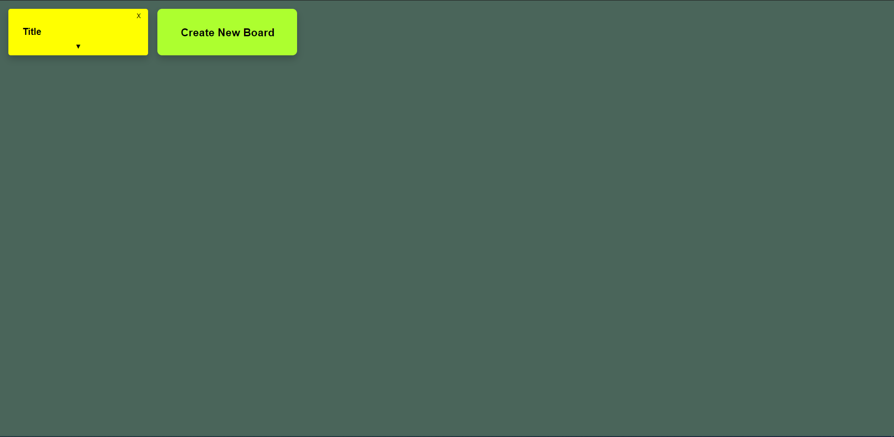
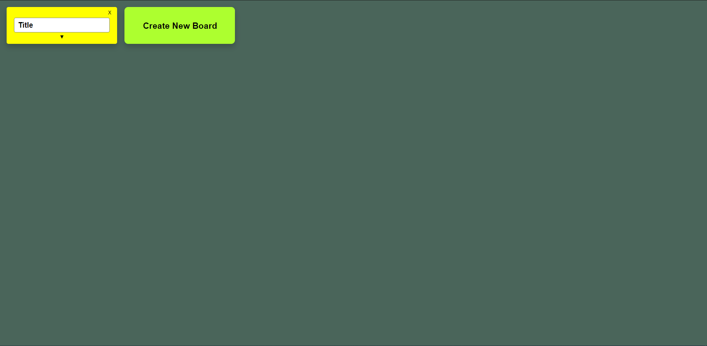
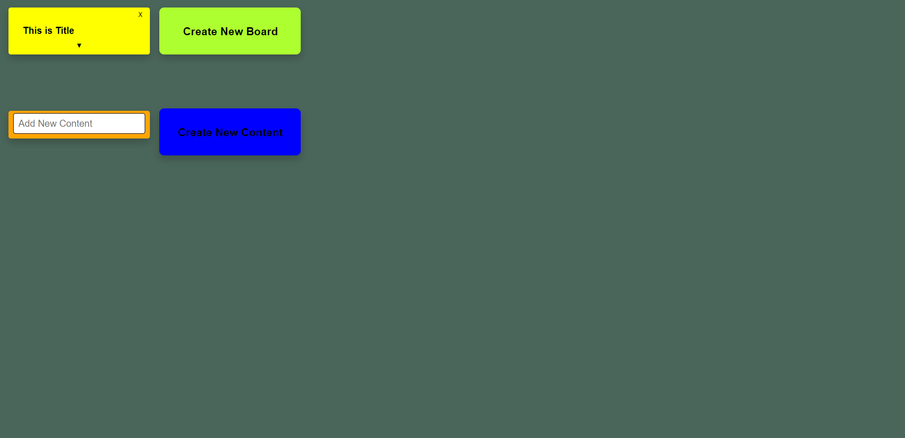
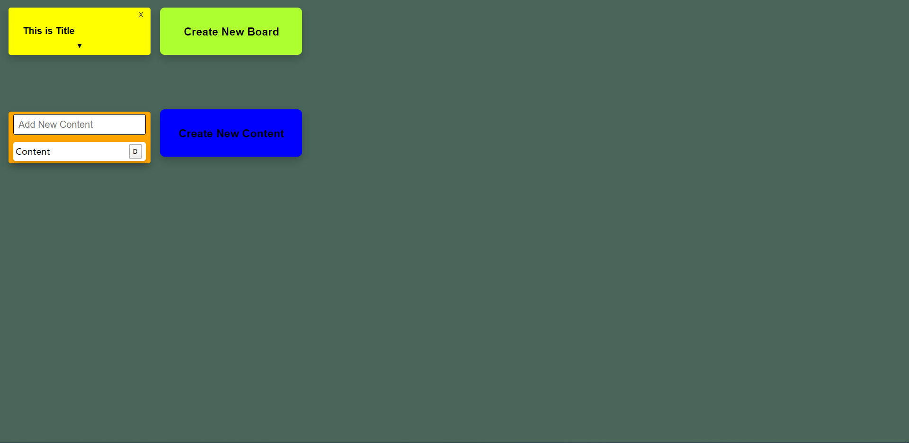
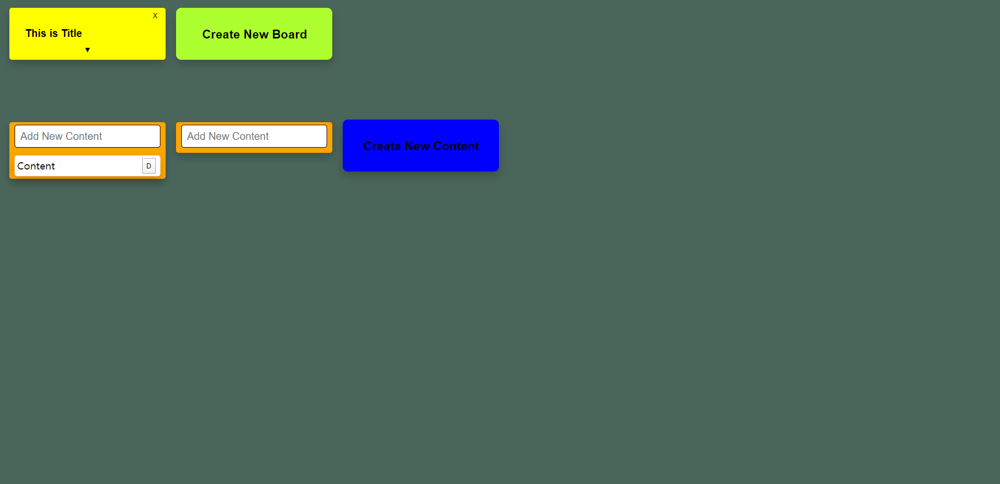

# Todo App
This is **Todo App** that cloned the trello.

## Screen
---
Run this app and you will see this screen

Clicking on the 'Create New Board' button will create a new board.

If you click on title, you can modify the title.

And then, '▼' button can see content stored on board.

If you want to add content, click input, write down the content you want to insert, and press enter to add it.

Finally, you can create a content list by pressing 'Create New Content'.

Thank you for read my todo app!
